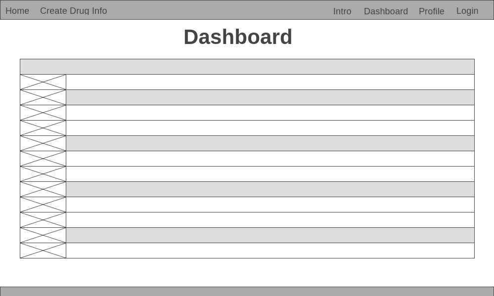
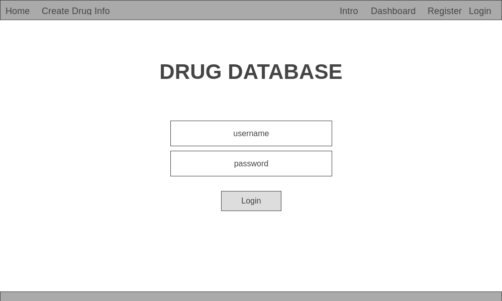
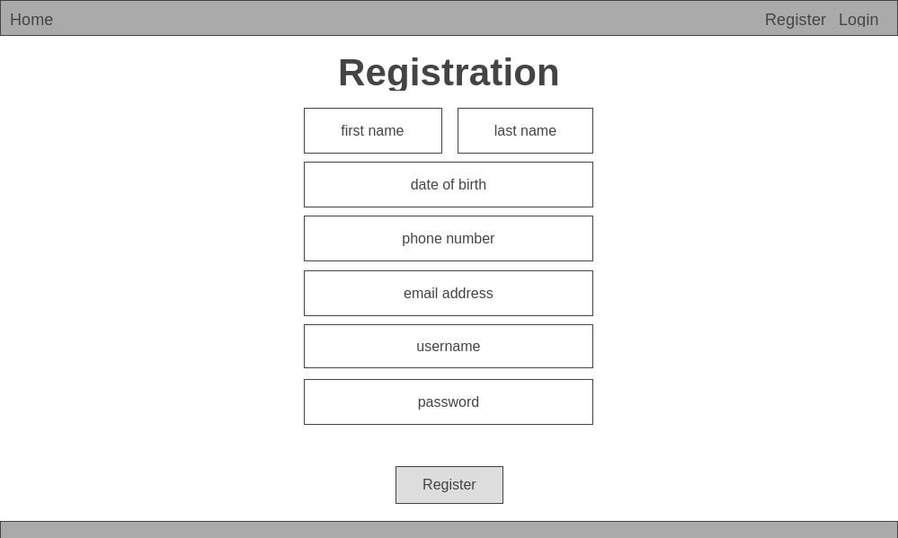
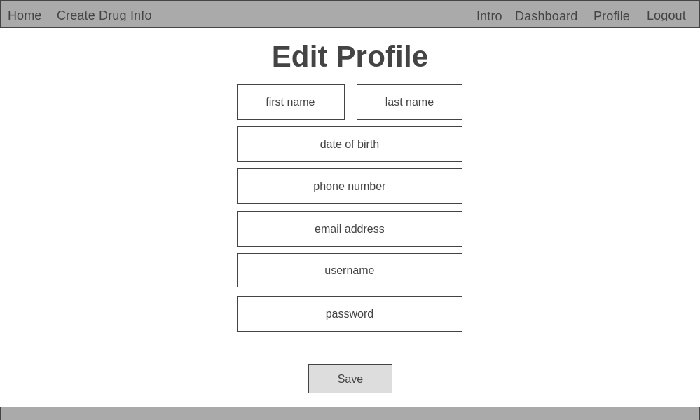
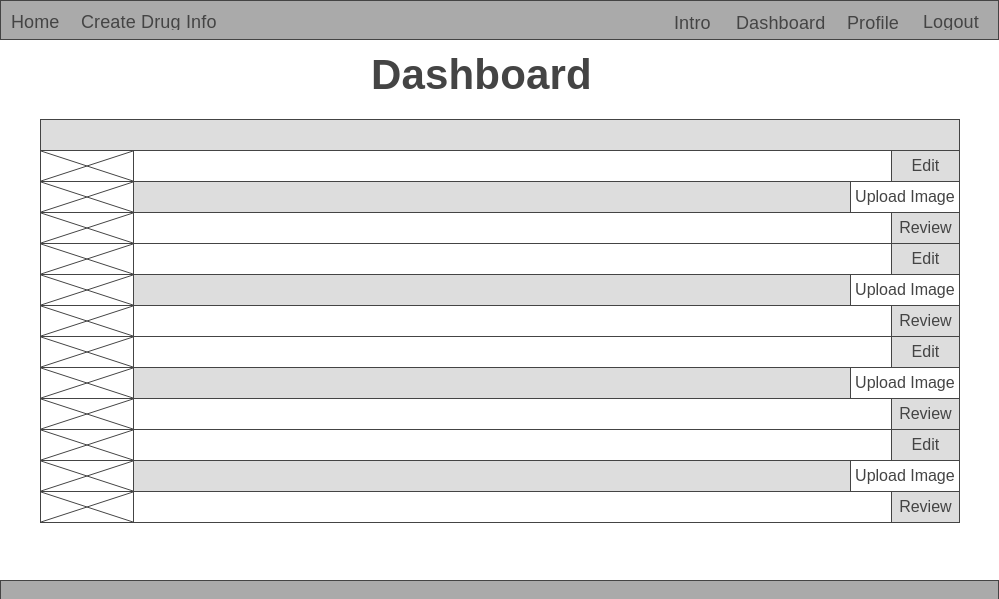
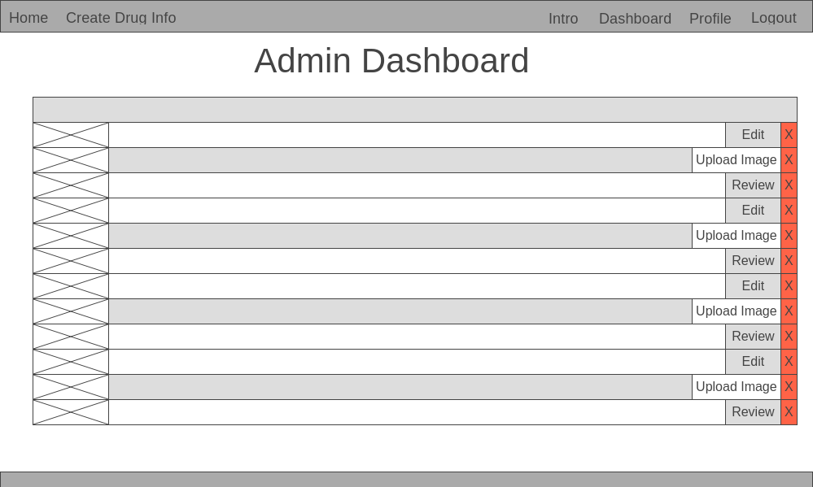
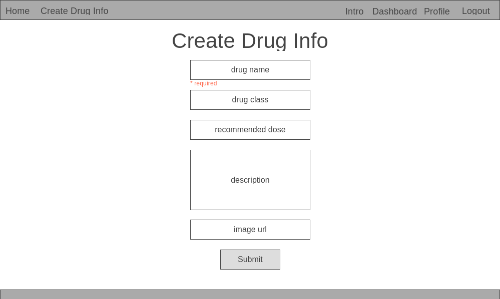
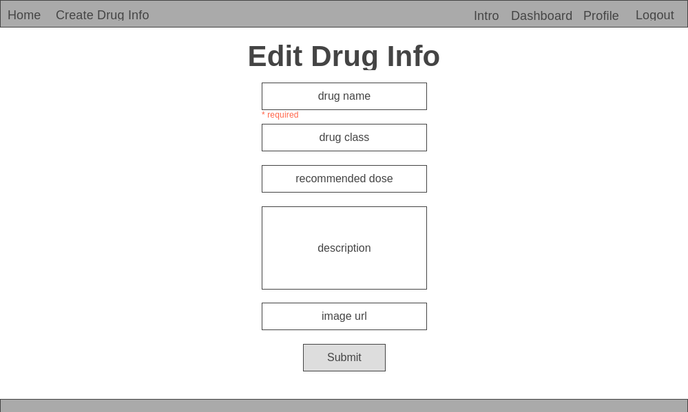
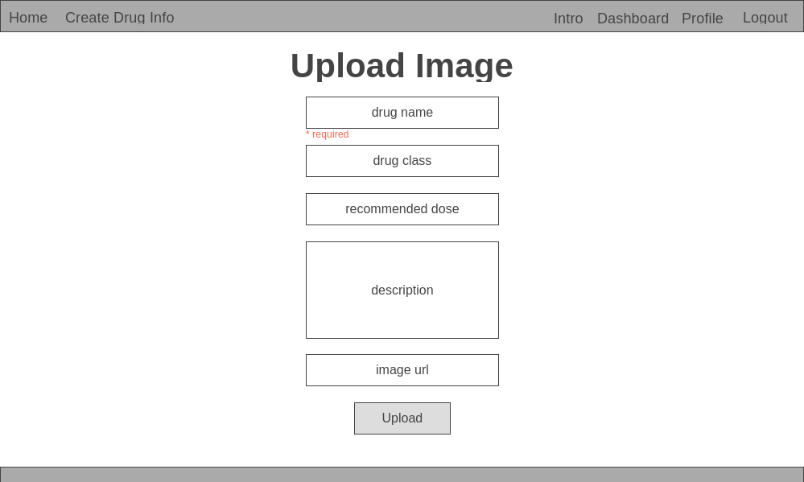
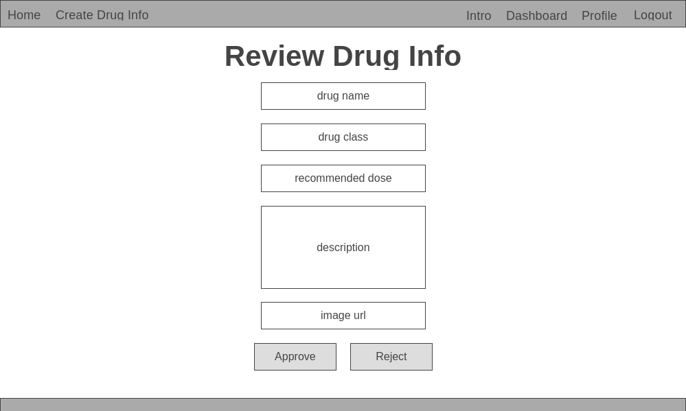

# SEI-23 Project Two - Drug Database
- Made by **Fabien Lim Zheng Kai**. All Rights Reserved. - © 2020

## 1. Technologies Used
- HTML
- CSS
- JavaScript
- [Node.js](https://nodejs.org/en/)
- [MongoDB](https://www.mongodb.com/)
- [Express](https://expressjs.com/)
- [Embedded JavaScript templates - EJS](https://ejs.co/)
- [Cloudinary API](https://cloudinary.com/)
- [Wireframe.cc](https://wireframe.cc/)

## 2. Approach Taken 
- This project was originally written in .NET/C# for my polytechnic's Final Year Project, it was packed with a lot of features. It was builded within six months and by a team of four members working on different parts at the same time, I have recreated a simplified version within a week time but with similiar features.

### [Wireframe](https://wireframe.cc/pro/pp/7eb3e9beb359657)











### Database 
``` text
User = {
  firstname,
  lastname,
  dateOfBirth,
  phone,
  email,
  password,
  created,
  edited,
  approved,
  rejected,
  isAdmin
}

Drug = {
  {
    name,
    drugClass,
    recommendedDose,
    imageUrl,
    status,
    createdBy,
    editedBy,
    approvedBy,
    rejectedBy
  }
  timestamps
}
```
## 3. Install Instruction
[Access online here](https://sei23sg-drug-database.herokuapp.com/)

## 4. Unsolved Problems/Things to improve
- Search function
- Able to sort the table